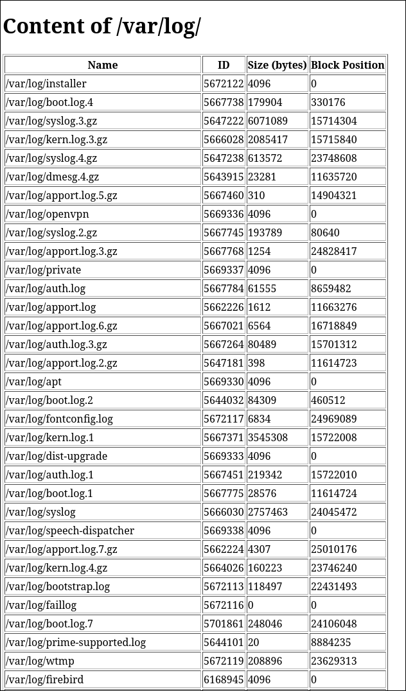

# Devoir en Programmation Systeme

Ce programme génère un fichier HTML listant les fichiers d'un répertoire sélectionné aléatoirement parmi `/etc/`, `/var/log/`, ou `/usr/local`. Il inclut des informations sur le nom, l'ID, la taille et la position sur le disque de chaque fichier.

## Compilation

Utilisez la commande suivante pour compiler le programme :

```bash
gcc -o export_file_info export_file_info.c
```

## Execution

Executez le programme en tant qu'admin pour obtenir les infos nécessaires

```bash
sudo ./export_file_info
```

## Resultat

